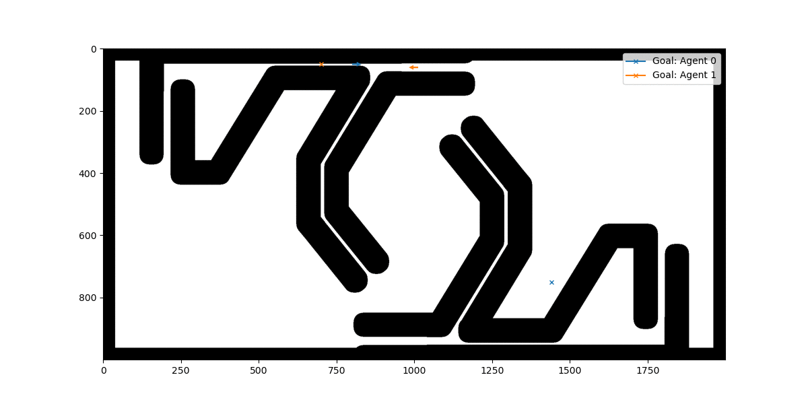

# OVS-Tracker
IROS2025 Submit

2025.03.12

We are in the process of removing sensitive information from the code, and we will update it in about two weeks. The current parameter settings are:

maximum velocity vm = 2.5 m/s, ωm = 1.5 rad/s
maximum acceleration am = 1.5 m/s
αm = 1.0 rad/s
weights of penalty J λd = 100, λf = 0.01, λs = 10−6
weights of penalty L µv = 100, µf = 0.1, µs = 0.01

# Simulation Update

2025.04.01

We have updated the simulation part of the algorithm. The experiment can now be completed using some basic Python libraries. It includes centralized global conflict resolution and distributed trajectory optimization. The optimization formula is in a simplified version, and we will release the full C++ version later.

### Directory Structure
- `sim/map`: Contains the map files for agent simulation.
- `sim/map/photo`: Holds the output images from the simulation.
- `sim/src`: This is where the code resides.
- `sim/demo`: Stores the simulation configuration files.

The following GIF file demonstrates the running effect of the simulation (the arrows represent the agents).

